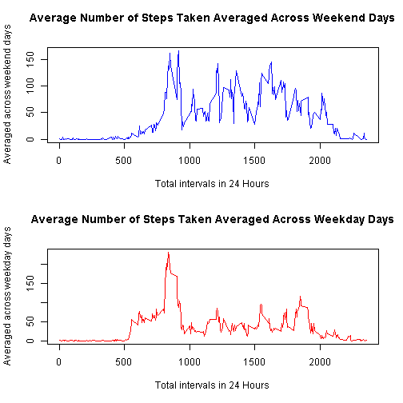

# Reproducible Research: Peer Assessment 1


---

First get the working directory

```r
setwd("C:/PredictiveAnalysis/R")
```

## Loading and preprocessing the data

Read in the data.

```r
activity<-read.csv("activity.csv")
```
Find out the type of fields of the activity file, examine the data

```r
str(activity)
```

'data.frame':	17568 obs. of  3 variables:
 $ steps   : int  NA NA NA NA NA NA NA NA NA NA ...
 $ date    : Factor w/ 61 levels "2012-10-01","2012-10-02",..: 1 1 1 1 1 1 1 1 1 1 ...
 $ interval: int  0 5 10 15 20 25 30 35 40 45 ...

```r
summary(activity)
```

     steps               date          interval   
 Min.   :  0.0   2012-10-01:  288   Min.   :   0  
 1st Qu.:  0.0   2012-10-02:  288   1st Qu.: 589  
 Median :  0.0   2012-10-03:  288   Median :1178  
 Mean   : 37.4   2012-10-04:  288   Mean   :1178  
 3rd Qu.: 12.0   2012-10-05:  288   3rd Qu.:1766  
 Max.   :806.0   2012-10-06:  288   Max.   :2355  
 NA's   :2304    (Other)   :15840                 
We find that we have to change the date column to date and to accomodate the date format

```r
activity$date <- as.Date(activity$date)
```
---------

## What is mean total number of steps taken per day?
- For this part of the assignment, I am ignoring the missing values in the dataset.

```r
activity.ignore.na <- na.omit(activity)
```

- Make a histogram of the total number of steps taken each day

```r
steps.by.date<-aggregate(steps ~ date, data = activity.ignore.na, FUN = sum)
library(ggplot2)
qplot(x=steps.by.date$date, y=steps.by.date$steps, data=steps.by.date, geom='bar', stat='identity')+ geom_bar(fill="#F0E442", colour="black", stat="identity")+ labs(title='Number of steps taken daily\n',y='Total steps per day', x='Date')
```

 

- Calculate and report the mean and median total number of steps taken per day

```r
## Mean
mean(steps.by.date$steps)
```

[1] 10766

```r
## Median
median(steps.by.date$steps)
```

[1] 10765
## What is the average daily activity pattern?
1. Make a time series plot (i.e. type = "l") of the 5-minute interval (x-axis) and the average number of steps taken, averaged across all days (y-axis).

- First, we will calculate the average of each interval for the 24 hours period

```r
library(plyr)
mean.steps.by.interval <- ddply(activity.ignore.na,~interval,summarise,mean=mean(steps))
```
- Second, make the plot

```r
qplot(x=mean.steps.by.interval$interval, y=mean.steps.by.interval$mean, data=mean.steps.by.interval, geom='line')+ geom_line(colour="blue", stat="identity")+ labs(title='Average Number of Steps Taken Averaged Across All Days\n',y='Averaged across all days', x='Total intervals in 24 Hours')
```

 
2. Which 5-minute interval, on average across all the days in the dataset, contains the maximum number of steps?

```r
mean.steps.by.interval[which.max( mean.steps.by.interval$mean ),1]
```

[1] 835
## Imputing missing values
1. Calculate and report the total number of missing values in the dataset (i.e. the total number of rows with NAs)

```r
apply(activity, 2, function(x) length(which(is.na(x))))
```

   steps     date interval 
    2304        0        0 

```r
### or 
summary(activity)
```

     steps            date               interval   
 Min.   :  0.0   Min.   :2012-10-01   Min.   :   0  
 1st Qu.:  0.0   1st Qu.:2012-10-16   1st Qu.: 589  
 Median :  0.0   Median :2012-10-31   Median :1178  
 Mean   : 37.4   Mean   :2012-10-31   Mean   :1178  
 3rd Qu.: 12.0   3rd Qu.:2012-11-15   3rd Qu.:1766  
 Max.   :806.0   Max.   :2012-11-30   Max.   :2355  
 NA's   :2304                                       

2. Devise a strategy for filling in all of the missing values in the dataset. The strategy does not need to be sophisticated. For example, you could use the mean/median for that day, or the mean for that 5-minute interval, etc.
### I will use the mean for the 5-minute intervals as fillers for missing values.


```r
activity <- merge(activity, mean.steps.by.interval, by = "interval")
the_nas<-is.na(activity$steps)
activity$steps[the_nas]<-activity$mean[the_nas]
```

3. Create a new dataset that is equal to the original dataset but with the missing data filled in.

```r
activity <- activity[, c(1:3)]
```

4. Make a histogram of the total number of steps taken each day and Calculate and report the mean and median total number of steps taken per day. Do these values differ from the estimates from the first part of the assignment? What is the impact of imputing missing data on the estimates of the total daily number of steps?

```r
steps.by.date.merged<-aggregate(steps ~ date, data = activity, FUN = sum)
qplot(x=steps.by.date.merged$date, y=steps.by.date.merged$steps, data=steps.by.date.merged, geom='bar', stat='identity')+ geom_bar(fill="#FF9999", colour="black", stat="identity")+ labs(title='Number of steps merged taken daily\n',y='Total steps per day', x='Date')
```

 

- Calculate and report the mean and median total number of merged steps taken per day

```r
## Mean
mean(steps.by.date.merged$steps)
```

[1] 10766

```r
## Median
median(steps.by.date.merged$steps)
```

[1] 10766
-  These received values (mean and median) did not differ from the estimates from the first part of the assignment. In the Median there was a small difference of 1 unit which is almost very neglible.
- The impact of imputing missing data was neglible.


## Are there differences in activity patterns between weekdays and weekends?
1. Create a new factor variable in the dataset with two levels - "weekday" and "weekend" indicating whether a given date is a weekday or weekend day.


```r
daytype <- function(date) {
        if (weekdays(as.Date(date)) %in% c("Saturday", "Sunday")) {
                "weekend"
                } else {
                        "weekday"
                        }
        }

activity$daytype <- as.factor(sapply(activity$date, daytype))
```
2. Make a panel plot containing a time series plot (i.e. type = "l") of the 5-minute interval (x-axis) and the average number of steps taken, averaged across all weekday days or weekend days (y-axis). The plot should look something like the following, which was creating using simulated data:

- First, we will calculate the average of each interval for the 24 hours period

```r
weekend.interval<- aggregate(steps ~ interval, data = activity, subset = activity$daytype == "weekend", FUN = mean)
weekday.interval<- aggregate(steps ~ interval, data = activity, subset = activity$daytype == "weekday", FUN = mean)
```
- Second, make the plots

```r
qplot(x=weekend.interval$interval, y=weekend.interval$steps, data=weekend.interval, geom='line')+ geom_line(colour="blue", stat="identity")+ labs(title='Average Number of Steps Taken Averaged Across Weekend Days\n',y='Averaged across weekend days', x='Total intervals in 24 Hours')
```

 
 


Final Observations:

There differences btween the activity patterns between weekdays and weekends. The plot indicates that the person moves around more (or more active) during the weekend days.

